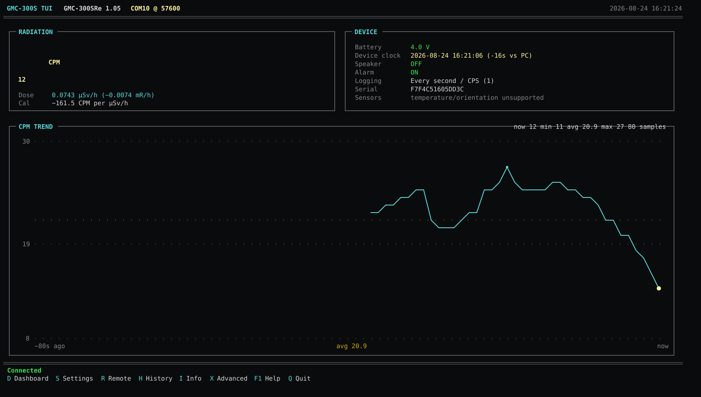

# GMC-300S Windows TUI

A Windows terminal user interface for the **GQ Electronics GMC-300S** Geiger counter, written in C#/.NET 8.

It talks directly to the counter over its USB serial port; GQ's desktop software is not required.



*Responsive Windows Terminal dashboard based on an actual GMC-300SRe 1.05 session, showing live CPM/dose, device state, and the scaled multi-row CPM trend graph.*

## What it does

- Responsive, colored Windows terminal dashboard that expands with the available rows and columns
- Multi-row CPM time-series graph with current/minimum/average/maximum statistics
- Up to ten minutes of in-memory CPM samples; wider terminals reveal more history instead of stretching a fixed 60 points
- Large block-number CPM readout when the terminal has enough room
- Compact fallback layout for smaller console windows
- Dose-rate estimate (µSv/h and mR/h) using the counter's own three calibration points
- Battery voltage
- Device date/time, live PC clock-drift display, and one-key clock synchronization
- Model capability table that prevents unsupported sensor commands from being shown as real readings
- Device version and serial number
- Speaker/click mute/unmute (`SPEAKER0` / `SPEAKER1`)
- Alarm enable/disable (`ALARM0` / `ALARM1`)
- USB remote control of the four physical buttons (`KEY0`..`KEY3`)
- 256-byte configuration reader and hex viewer
- Named settings editor for every S-series configuration field for which I found a useful mapping
- Automatic binary + decoded-text configuration backups before EEPROM writes
- Post-write verification after `WCFG` + `CFGUPDATE`
- Serial baud-rate changes with automatic PC-side reconnect
- 64 KiB history download using `SPIR`
- Raw history `.bin` plus best-effort parsed `.csv`
- Advanced commands: reboot, power off/on, factory reset, raw config-byte write, config erase, config refresh

## Responsive/color UI

The default UI uses a cell-buffer renderer built on `System.Console` colors rather than embedding ANSI escape sequences in strings. This keeps colors from breaking text-width calculations and works in Windows Terminal as well as traditional Windows console hosts.

The dashboard automatically changes layout according to the current terminal dimensions:

- **Compact:** one-column metrics plus a small graph when space allows
- **Wide:** radiation and device panels side-by-side with a detailed CPM graph below
- **Large:** adds a five-row block-number CPM display and gives most remaining vertical space to the graph

The CPM graph has a scaled Y axis, grid lines, an average reference line, current/min/average/max statistics, and uses as many recent samples as fit across the available terminal width. The polling buffer retains up to roughly ten minutes of samples.

Color is semantic rather than decorative: cyan identifies radiation/data, yellow emphasizes the live CPM/latest graph point, green identifies healthy/confirmed states, yellow calls attention to caution or clock drift, red is reserved for failures and destructive/expert operations, and dark gray is used for secondary/unsupported information.

The original compact renderer is still included as a fallback during hardware testing:

```powershell
dotnet run -c Release -- --classic
```

## Important safety note about settings

GQ publishes the **serial command protocol**, but it does **not publish a complete, versioned specification of the 256-byte configuration layout**. The settings map is therefore best-effort and is assembled from GQ support postings plus the open-source PyGMC implementation.

The program deliberately distinguishes:

- **Normal** settings: reasonably understood
- **Caution** settings: useful mapping, but firmware interpretation may differ
- **Expert** settings: offset/name is known, exact encoding or semantics are uncertain
- **Read-only** fields: displayed but not edited by the normal settings UI

Every EEPROM edit makes a backup first. The Info screen always shows all 256 raw bytes, including fields that are not interpreted.

## Build

Install the current .NET 8 SDK for Windows, then from this folder:

```powershell
dotnet restore
dotnet build -c Release
```

Run directly:

```powershell
dotnet run -c Release -- --port COM10 --baud 57600
```

Or publish a self-contained Windows x64 executable:

```powershell
dotnet publish -c Release -r win-x64 --self-contained true -p:PublishSingleFile=true
```

The executable will be under:

```text
bin\Release\net8.0-windows\win-x64\publish\gmc300s-tui.exe
```

The defaults are already **COM10** and **57600 baud**, matching the counter used while this project was created.

## Keyboard

Global keys:

| Key | Action |
|---|---|
| `D` | Dashboard |
| `S` | Settings |
| `R` | Remote keypad |
| `H` | History |
| `I` | Info/raw config |
| `X` | Advanced commands |
| `M` | Speaker/click toggle |
| `A` | Alarm toggle |
| `T` | Sync counter clock to Windows |
| `F1` | Help |
| `Q` / `Ctrl+C` | Quit |

Remote keypad:

| PC key | Counter command |
|---|---|
| `Esc`, `Backspace`, `Left` | S1 / `KEY0` / Back |
| `Up` | S2 / `KEY1` / Up |
| `Down` | S3 / `KEY2` / Down |
| `Enter`, `Right` | S4 / `KEY3` / Enter/Menu |

## Files created by the program

Configuration backups:

```text
%LOCALAPPDATA%\Gmc300sTui\config-backups
```

History exports:

```text
%LOCALAPPDATA%\Gmc300sTui\history
```

## Protocol sources used

- GQ RFC1201, GMC communication protocol: https://www.gqelectronicsllc.com/download/GQ-RFC1201.txt
- GQ GMC-300E Plus / GMC-300S user guide: https://www.gqelectronicsllc.com/gmc_300e_plus_user_guide.pdf
- GQ support discussion with S-series config field ordering: https://www.gqelectronicsllc.com/forum/topic.asp?TOPIC_ID=10116
- PyGMC device implementation: https://github.com/Wikilicious/pygmc

### Confirmed on the specific GMC-300S used here

The following were tested manually against a **GMC-300SRe 1.05** before and during development:

- USB serial at 57600 baud on COM10
- `<GETCPM>>`
- `<SPEAKER0>>`
- `SPEAKER0` returned `0xAA` and immediately stopped the physical clicks
- battery voltage, RTC, configuration, serial number, alarm state, and logging mode reads

## GMC-300S capability handling

The wider GQ protocol family contains commands such as heartbeat CPS streaming, `GETTEMP`, and `GETGYRO`, but a command existing in the family does not mean a GMC-300S has the corresponding sensor or returns meaningful data. On the tested GMC-300SRe 1.05, the apparent temperature and gyro values were bogus.

The TUI therefore uses a model capability table. For GMC-300S it:

- keeps heartbeat disabled during normal command/response polling so unsolicited CPS bytes cannot contaminate replies
- displays CPS as unavailable rather than showing a misleading zero
- does not poll `GETTEMP` or `GETGYRO`
- explicitly marks temperature and orientation as unsupported in device capability information

Unknown models default to the same conservative optional-feature set until verified on hardware.

## Build validation

A Windows GitHub Actions workflow restores and builds the project with .NET 8 on pushes and pull requests to `main`.

## History parsing

GQ documents how to read flash (`SPIR`) but does not fully document the binary history record format. The included parser follows the record-marker scheme used by PyGMC: context records begin with `55 AA 00`, larger count values use `55 AA 01/03/04`, and save modes determine whether timestamps advance by a second, minute, or hour. The raw `.bin` is always preserved even if parsing encounters firmware-specific data.
